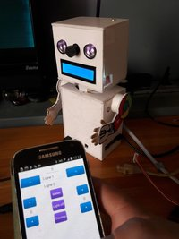
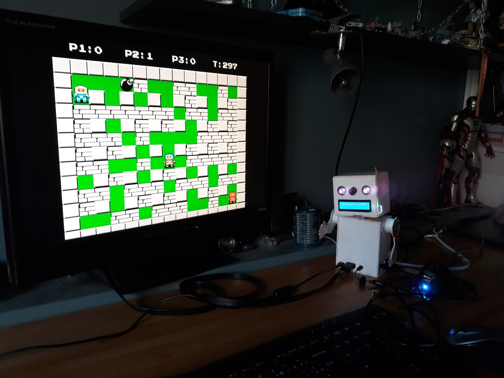

# Piroman : Raspberry *Pi* *ro*bot for Weather and Video Surveillance 

This project allows to create a raspberry pi robot controlled by an android application, over bluetooth.
This robot can gives information on weather (temperature, pression, humidity), and is a also a camera surveillance 

It can also be transformed into a [Retropi](https://retropie.org.uk/) console:
- You just need to replace its SD card with a Retropie one, and connect joysticks.

.

## Prerequisites

You need to have
- A Raspberry pi 3, with its alimentation and with a raspbian OS
- The [OSOYOO starter kit](https://www.amazon.fr/OSOYOO-Raspberry-Electronique-explorateurs-amateurs/dp/B074YZMRC1)
- A [night vision camera module](https://www.amazon.fr/gp/product/B071J14338)
	- with a longer cable : [30cm](https://www.amazon.fr/gp/product/B01NAXKTDP)  or [20cm](https://www.amazon.fr/gp/product/B00RMV2L0M)
- a raspberry compatible [Wifi Dongle](https://www.amazon.fr/gp/product/B003MTTJOY)

To build the body, the head, the arms of your robots, you can use Cardboard, or balsa, on thin woods.

On your raspberry, you need to :
- [Configure Wifi](http://weworkweplay.com/play/automatically-connect-a-raspberry-pi-to-a-wifi-network/)
- [enable SSH](https://www.raspberrypi.org/documentation/remote-access/ssh/README.md) on your Raspberry pi.
 
*Tips:
To enable SSH and auto configure Wifi when writing raspbian OS onto SD card, add an empty file named `ssh` and a [wpa_suppliant.conf](./conf/wpa_suppliant.conf)*

## Pyroman : Python scripts on Piroman

Connect, via SSH, to your raspberry pi and configure a shared folder `pyroman`

With your file explorer go into \\RASPBERRYPI\pyroman. Copy all files from [Pyroman](./Pyroman) onto this shared folder
