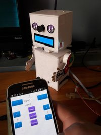
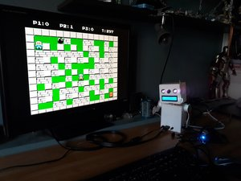
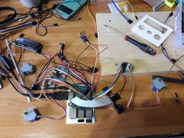

# Piroman

Raspberry **Pi** **ro**bot for Weather and Video Surveillance :



This project allows to create a raspberry pi robot controlled by an android application ([Piroid](#piroid)), over bluetooth, with python scripts ([Pyroman](#pyroman)).
This robot can gives information on weather (temperature, pression, humidity), and is a also a surveillance camera.

I have made this project to learn python, linux, raspberry, robotic, electronic, android, bluetooth...

It can also be transformed into a [Retropi](https://retropie.org.uk/) console. You just need to replace its SD card with a Retropie one, and connect joysticks.

.

## Table of Contents

   * [Piroman](#piroman)
      * [Prerequisites](#prerequisites)
      * [GPIO](#gpio)
         * [Configuration](#configuration)
         * [Assembly](#assembly)
      * [Pyroman](#pyroman)
         * [Configure shared folder](#configure-shared-folder)
         * [Change computer name](#change-computer-name)
         * [Configure bluetooth](#configure-bluetooth)
         * [Install and configure Motion](#install-and-configure-motion)
         * [Add Pyroman scripts](#add-pyroman-scripts)
         * [Launch Pyroman server](#launch-pyroman-server)
         * [Install Piroman as a service](#install-piroman-as-a-service)
      * [Piroid](#piroid)
      * [Debug](#debug)
      * [References](#references)


## Prerequisites

You need to have
- A Raspberry pi 3, with its alimentation and with a raspbian OS
- The [OSOYOO starter kit](https://www.amazon.fr/OSOYOO-Raspberry-Electronique-explorateurs-amateurs/dp/B074YZMRC1)
- A [night vision camera module](https://www.amazon.fr/gp/product/B071J14338)
	- with a longer cable : [30cm](https://www.amazon.fr/gp/product/B01NAXKTDP)  or [20cm](https://www.amazon.fr/gp/product/B00RMV2L0M)
- A raspberry compatible [Wifi Dongle](https://www.amazon.fr/gp/product/B003MTTJOY)


To build the body, the head, the arms of your robots, you can use cardboard, balsa, on thin woods.


On your raspberry, you need to :
- [Install latest Raspbian OS](https://www.raspberrypi.org/downloads/raspbian/)
- [Configure Wifi](http://weworkweplay.com/play/automatically-connect-a-raspberry-pi-to-a-wifi-network/)
- [enable SSH](https://www.raspberrypi.org/documentation/remote-access/ssh/README.md)

Update and upgrade to have latest version :
```
sudo apt-get update
sudo apt-get upgrade
```

*Tips:
To enable SSH and auto configure Wifi, write raspbian OS image onto your SD card, and in `boot` disk,  
add an empty file named `ssh` and a file `wpa_suppliant.conf` (cf [Raspbian Stretch Headless Setup Procedure](https://www.raspberrypi.org/forums/viewtopic.php?t=191252))

## GPIO

I follow needed tutorials on [Osoyoo Raspberry Pi Starter Ki tutorials](http://osoyoo.com/2017/07/13/raspberry-pi-3-starter-learning-kit-introduction/).

### Configuration

We need to activate I2C on our Pi
```
sudo raspi-config
```
Go into `Interfacing Options->I2C` and enable it

### Assembly

Here is the electronic assembly :

.

TODO

## Pyroman

### Configure shared folder

Connect, via SSH, to your raspberry pi and [configure a shared folder](https://raspberrypihq.com/how-to-share-a-folder-with-a-windows-computer-from-a-raspberry-pi/) `pyroman`:

```
sudo mkdir -m 1777 ~/pyroman
sudo apt-get install samba samba-common-bin
```

In `/etc/samba/smb.conf`, make sure you have:
```
workgroup = WORKGROUP
wins support = yes
```
And add lines at the end: 
```
[pyroman]
        comment = Pyroman Shared Folder
        path = /home/pi/pyroman
        browsable = yes
        guest ok = yes
        writable = yes
        create mask = 0644
        directory mask = 0755
        force create mask = 0644
        force directory mask = 0755
        force user = pi
        force group = pi
```
### Change computer name

Edit `/etc/hosts` to change the computer name:
```
sudo nano /etc/hosts
```
And replace `127.0.1.1 raspberrypi` with `127.0.1.1 piroman`

### Configure bluetooth

We need to install bluetooth (cf [Tutorial](https://circuitdigest.com/microcontroller-projects/controlling-raspberry-pi-gpio-using-android-app-over-bluetooth))
```
sudo apt-get install bluetooth blueman bluez
sudo reboot
sudo apt-get install python-bluetooth
sudo apt-get install python-rpi.gpio
```

Activate bluetooth on your raspberry
```
sudo bluetoothctl
[bluetooth]# power on
[bluetooth]# agent on
[bluetooth]# discoverable on
[bluetooth]# pairable on
[bluetooth]# scan on
[bluetooth]# quit	
```

To rename the bluetooth device name, create file `/etc/machine-info` and put inside:
```
PRETTY_HOSTNAME=Piroman
```

We will need to add access to bluetooth for user pi
```
sudo adduser pi bluetooth
```
Also, edit file `/lib/systemd/system/bluetooth.service` and add `-C` at the end of this line:
```
ExecStart=/usr/lib/bluetooth/bluetoothd -C
```
Then restart bluetooth:
```
sudo systemctl daemon-reload
sudo systemctl restart bluetooth
```


### Install and configure Motion

Motion is a tool to detect motion with camera. We need to [install it](https://raspbian-france.fr/video-surveillance-raspberry-pi-camera/) :
```
sudo apt-get install motion
```

To enable motion to work with raspberry camera, you need to execute :
```
sudo modprobe bcm2835-v4l2
echo "bcm2835-v4l2" | sudo tee -a /etc/modules
```

Edit file `/etc/default/motion` to enable motion as a daemon
```
start_motion_daemon=yes
```
Edit `/etc/motion/motion.conf` to change these lines, or use the provided [motion.conf](./conf/motion.conf)
```
# Start in daemon (background) mode and release terminal (default: off)
daemon on

# Use a file to save logs messages, if not defined stderr and syslog is used. (default: not defined)
logfile /home/pi/pyroman/log/motion.log

# Image width (pixels). Valid range: Camera dependent, default: 352
width 320
height 240

pre_capture 2
post_capture 2

max_movie_time 300

output_pictures best

ffmpeg_video_codec msmpeg4

locate_motion_mode on

target_dir /home/pi/pyroman/camera

snapshot_filename %v-%Y%m%d-%H%M%S-snapshot
picture_filename %v-%Y%m%d-%H%M%S-%q
movie_filename %v-%Y%m%d-%H%M%S

# Restrict stream connections to localhost only (default: on)
stream_localhost off

on_movie_start  /home/pi/pyroman/event/onMovieStart.sh 

```

We also need to activate camera on Pi
```
sudo raspi-config
```
Go into `Interfacing Options->Camera` and enable it


To allow motion to write log, videos, images, we need to add user `motion` to pi `group`, and change some rights
```
sudo adduser motion pi
mkdir log
chmod -R g+rw ~/pyroman/log
mkdir camera
chmod -R g+rw ~/pyroman/camera
```

Restart  motion
```
sudo service motion restart
```
To verify if motion works fine, go to [http://piroman:8081](http://piroman:8081)

If you move in front of camera, you should have  AVI and JPG file generated in `~/python/camera`

### Add Pyroman scripts

TODO 

With your file explorer, go into \\piroman\pyroman. Copy all files from [Pyroman/script](./Pyroman/script) onto this shared folder.


### Launch Pyroman server

You can launch pyroman server by using :
```
sudo python pyroman-server.py
```
You can test your android application now, if you already have it. But we need piroman server to be launched at startup. For that we need to add a service.

### Install Piroman as a service

To [install it as a service](http://www.diegoacuna.me/how-to-run-a-script-as-a-service-in-raspberry-pi-raspbian-jessie/), copy [piroman.service](./conf/piroman.service) into your home folder, and run command :
```
sudo cp ~/piroman.service /lib/systemd/system
sudo chmod 644 /lib/systemd/system/piroman.service
chmod +x /home/pi/pyroman/pyroman-server.py
sudo systemctl daemon-reload
sudo systemctl enable piroman.service
sudo systemctl start piroman.service
```
You can check the log in `~/pyroman/log/piroman.service`. If there is none, check the status of piroman service:
```
sudo systemctl status piroman.service
```


## Piroid

Piroïd is the android application that connect to pyroman-server over bluetooth.
It is not available yet on Play store. 

Open the [project](./Piroid) in Android studio project, and simply launch it.

You need to connect a remote device (your phone) to be able to use bluetooth.


## Debug

To debug the piroman service, use
```
sudo systemctl status piroman.service
```
Or if you are editing piroman.service:
```
sudo cp piroman.service /lib/systemd/system &&  sudo systemctl daemon-reload &&  sudo systemctl restart piroman.service &&  sudo systemctl status piroman.service
```

## References

- Android Linux / Raspberry Pi Bluetooth communication : http://blog.davidvassallo.me/2014/05/11/android-linux-raspberry-pi-bluetooth-communication/
- How to run a script as a service in Raspberry pi : http://www.diegoacuna.me/how-to-run-a-script-as-a-service-in-raspberry-pi-raspbian-jessie/